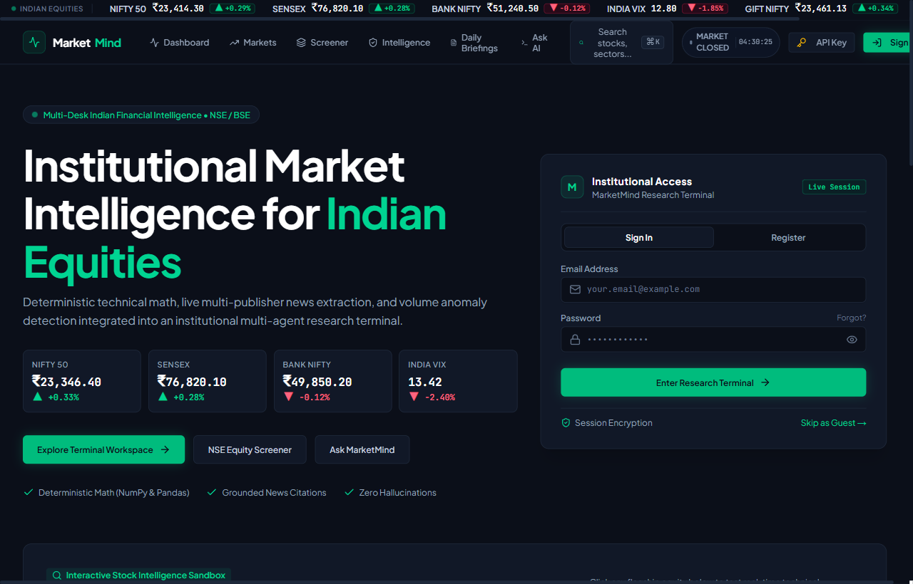

# MarketMind — AI-Powered Indian Stock Market Intelligence

[](https://nextjs.org/)
[](https://fastapi.tiangolo.com/)
[](https://python.org/)
[](https://typescriptlang.org/)
[](LICENSE)

An institutional-grade financial intelligence and multi-agent reasoning terminal built specifically for Indian equity markets (**NSE / BSE**).

MarketMind continuously tracks major benchmark indices (**NIFTY 50, SENSEX, BANK NIFTY, INDIA VIX**), calculates deterministic mathematical technical indicators in Python, ingests live financial news feeds, and coordinates a team of 4 specialized AI reasoning desks to deliver grounded, explainable market insights.

---

## Platform Preview



---

## Core Features

### 📊 Real-Time Market Engine & Breadth Telemetry
- **Live Benchmark Indices**: Real-time quotes and historical charts for NIFTY 50, SENSEX, BANK NIFTY, and INDIA VIX with asynchronous caching and request deduplication.
- **Market Breadth & Sector Matrix**: Live Advances/Declines ratio, top gainers, top losers, and sectoral momentum matrix (IT, Banking, Auto, Energy, FMCG).
- **Synchronized IST Market Clock**: Real-time Indian Standard Time (IST) clock with automatic market phase detection (Pre-Open, Regular Trading Session, Post-Market Close).

### 🤖 4-Desk Multi-Agent AI Reasoning Architecture
- **Technical Analysis Desk**: Deterministic math computed in Python (`numpy`, `pandas`, `ta`) — RSI-14, MACD (12, 26, 9), SMA-20/50, Bollinger Bands, and Volume Ratios — eliminating LLM arithmetic hallucination.
- **News Intelligence Desk**: Scrapes, deduplicates, and summarizes financial press (Economic Times, Moneycontrol, Livemint) with verifiable source URLs.
- **Statistical Anomaly Desk**: Detects volume surges and price breakouts using rolling standard deviations and volume Z-scores.
- **Lead Synthesis Desk**: Consolidates multi-desk telemetry into directional consensus signals (Bullish / Neutral / Bearish) with evidence confidence ratings.

### 🔍 Dynamic Indian Equities Screener & Deep Dive Analysis
- **Universal Indian Ticker Search**: Search across NSE and BSE instruments using an in-memory cached Instrument Master.
- **Interactive Technical Charts**: High-performance TradingView lightweight candlestick charts with volume histograms and technical overlays.
- **Watchlist Synchronization**: Add or remove equities dynamically with instant background cache warm-up and multi-agent analysis.

### 💬 Grounded AI Research Terminal (`/ask`)
- **Context-Injected Market Chat**: Conversational AI research powered by Google Gemini, grounded in live NSE/BSE tick data and market news.
- **Sliding-Window Rate Limiter**: 15 requests/hour per user session to prevent API overuse and ensure predictable usage.
- **Bring Your Own Gemini API Key**: Users can insert their personal Google Gemini key to unlock unlimited, unmetered AI queries. Keys are encrypted at rest using PBKDF2-HMAC-SHA256.

### 📑 Tailored Daily Portfolio Briefings (`/reports`)
- Generates end-of-day market briefings customized to the user's actively tracked watchlist.
- Macro briefings archive with date filtering, markdown export, and one-click clipboard copying.

### 🔒 Enterprise Security & Master Admin Access Gatekeeping
- **Cryptographic Password Security**: PBKDF2-HMAC-SHA256 with 100,000 hashing rounds and 16-byte random cryptographic salts.
- **Tamper-Proof Session Tokens**: HMAC-SHA256 signed session tokens with constant-time verification (`hmac.compare_digest`).
- **Master Admin Access**: Restricted administrator access for `monthandas2008@gmail.com`.
- **User Approval Workflow**: All third-party registrations default to `pending` status and are gated (HTTP 403) until explicitly reviewed and approved by the Master Admin.
- **Admin Approvals Dashboard**: 1-click approve/reject actions and user roster management accessible exclusively to the Master Admin.
- **Zero Demo Credentials**: Completely purged of demo logins and auto-fill buttons for secure production deployment.

---

## System Architecture

```
MarketMind/
├── backend/                              # Python FastAPI Backend
│   ├── app/
│   │   ├── agents/                       # Specialized Multi-Agent AI Desks
│   │   │   ├── technical.py              # Technical Analysis (Deterministic Math)
│   │   │   ├── news_intel.py             # News Intelligence (RSS Extraction)
│   │   │   ├── anomaly.py                # Statistical Anomaly Detection (Z-Score)
│   │   │   ├── synthesis.py              # Lead Synthesis Consensus Engine
│   │   │   └── orchestrator.py           # Multi-Agent Workflow Coordinator
│   │   ├── db/                           # Database Client (Supabase / Local SQLite)
│   │   ├── llm/                          # Gemini LLM Integration & Prompt Caching
│   │   ├── middleware/                   # Security & Rate Limiting
│   │   ├── routes/                       # REST API Endpoints (Auth, Market, Chat, Reports)
│   │   └── services/                     # Data Feeds, Auth & Security Services
│   ├── tests/
│   │   └── test_system.py                # End-to-end integration and security test suite
│   ├── requirements.txt                  # Python dependencies
│   └── .env.example                      # Backend environment variable template
├── frontend/                             # Next.js 16 (Turbopack) Web Terminal
│   ├── src/
│   │   ├── app/                          # Next.js App Router Pages
│   │   ├── components/                   # UI Components, Modals & Visualizations
│   │   └── lib/                          # API Client, Auth Context, Formatters
│   ├── package.json                      # Node.js dependencies
│   └── .env.example                      # Frontend environment variable template
├── supabase/
│   └── migrations/                       # PostgreSQL Schemas (001, 002, 003)
├── docs/
│   └── assets/                           # Visual Documentation Assets
│       └── landing-page.png              # High-Resolution Landing Page Screenshot
├── LICENSE                               # MIT License
└── README.md                             # Project Documentation
```

---

## Quick Start & Local Development

### Prerequisites
- **Python**: 3.10 or higher
- **Node.js**: 18.0 or higher (v20+ recommended)
- **Git**

### 1. Clone Repository
```bash
git clone https://github.com/monthandas2008-gif/MarketMind-AI.git
cd MarketMind-AI
```

### 2. Backend Setup
```bash
cd backend

# Create & activate virtual environment
python -m venv venv
# On Windows:
venv\Scripts\activate
# On Linux/macOS:
# source venv/bin/activate

# Install dependencies
pip install -r requirements.txt

# Configure environment variables
cp .env.example .env
```

Edit `backend/.env`:
```ini
GEMINI_API_KEY=your_gemini_api_key_here     # (Optional: system fallback key)
GEMINI_MODEL=gemini-2.0-flash
SECRET_KEY=your_secure_random_master_secret # Secret for signing tokens & encrypting keys
FRONTEND_URL=http://localhost:3000
```
*(Supabase credentials are optional. If omitted, MarketMind automatically falls back to a local SQLite database at `backend/marketmind_local.db`.)*

### 3. Run Automated System Tests
```bash
python tests/test_system.py
```
Validates password hashing, session tokens, master admin gatekeeping, user approval workflow, and deterministic technical indicator math.

### 4. Start Backend Server
```bash
uvicorn app.main:app --host 127.0.0.1 --port 8000 --reload
```
API Documentation (Swagger UI): `http://127.0.0.1:8000/docs`

### 5. Frontend Setup
In a new terminal window:
```bash
cd frontend
cp .env.example .env.local
npm install
npm run dev
```
Open [http://localhost:3000](http://localhost:3000) in your browser.

---

## Production Deployment

### Deploying Frontend to Vercel
1. Push repository to **GitHub**.
2. Go to [Vercel](https://vercel.com/new) and import the repository.
3. Configure settings:
   - **Root Directory**: `frontend`
   - **Framework Preset**: `Next.js`
4. Set Environment Variables:
   - `NEXT_PUBLIC_API_URL`: Your deployed backend API URL (e.g. `https://your-backend.onrender.com`).
5. Click **Deploy**.

### Deploying Backend (Render / Railway / AWS / VPS)
1. Deploy as a Python web service pointing to the `backend/` directory.
2. **Build Command**: `pip install -r requirements.txt`
3. **Start Command**: `uvicorn app.main:app --host 0.0.0.0 --port $PORT`
4. **Environment Variables**:
   - `FRONTEND_URL`: Your Vercel frontend URL (e.g. `https://marketmind.vercel.app`)
   - `GEMINI_API_KEY`: Google Gemini API key
   - `SECRET_KEY`: Long random string for session tokens and key encryption
   - `SUPABASE_URL`: (Optional) Your Supabase project URL
   - `SUPABASE_SERVICE_KEY`: (Optional) Your Supabase service role key

### Supabase Migrations
If using Supabase PostgreSQL, execute in the **SQL Editor**:
1. `supabase/migrations/001_initial_schema.sql` (Core tables & instruments)
2. `supabase/migrations/002_dynamic_tracking_and_user_keys.sql` (Watchlists & user keys)
3. `supabase/migrations/003_users_and_approval_workflow.sql` (Users, PBKDF2 credentials & approval workflow)

---

## Educational & Compliance Disclaimer

MarketMind is designed and developed strictly for **educational, analytical, and research purposes**. Financial calculations, technical indicators, and multi-agent synthesis summaries represent analytical research frameworks and do not constitute financial advice, investment solicitation, or a recommendation to buy or sell any security. Always consult a SEBI-registered financial advisor before making investment decisions in the Indian equity markets.

---

## License

Distributed under the [MIT License](LICENSE).