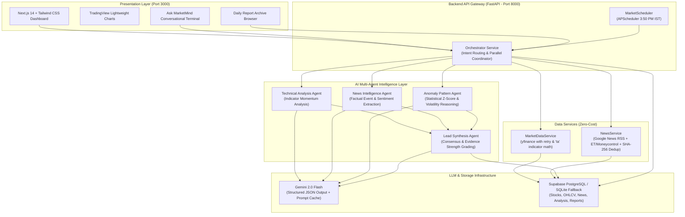

# MarketMind — Architectural Documentation

## 1. Executive Summary

**MarketMind** is an AI-powered financial intelligence agent system specialized for the Indian equity market (NSE/BSE). It continuously monitors benchmark indices (NIFTY 50), tracks key sector large-caps (Reliance, TCS, Infosys, ICICI Bank, ITC), calculates deterministic technical and statistical anomaly metrics, ingests deduplicated real financial news, and coordinates a team of 4 specialized AI agents to generate explainable, institutional-grade market intelligence.

---

## 2. Core Architectural Principles

1. **Deterministic-First Foundation:**
   - Numerical indicators (14-day RSI, MACD, 20/50-day SMAs, Bollinger Bands, ATR) and anomaly metrics (Volume Z-score, Return Z-score, intraday range expansions) are calculated purely mathematically using Python (`ta`, `pandas`, `numpy`).
   - LLMs are **NEVER** asked to do arithmetic. AI is reserved strictly for contextual interpretation and multi-agent synthesis.

2. **Provenance & Anti-Hallucination Control:**
   - The News Intelligence Agent ingests real RSS articles from verified Indian outlets (The Economic Times, Livemint, Moneycontrol, Google News RSS).
   - Every claim is tied to an explicit source name and URL.
   - If no news exists, the system explicitly reports: *"No high-impact idiosyncratic news found in the monitored window. Movement appears driven by technical factors or broad market sentiment."*

3. **Multi-Agent Specialization & Division of Labor:**
   - **Technical Analysis Agent:** Momentum, trend strength, moving average support/resistance.
   - **News Intelligence Agent:** Corporate announcements, regulatory circulars, media sentiment.
   - **Anomaly / Pattern Detection Agent:** Statistical deviations, volume spikes, gap openings.
   - **Synthesis Agent:** Cross-agent reasoning, consensus analytical signal, evidence strength evaluation.

4. **100% Free / Zero-Cost Operational Stack:**
   - Market Data: `yfinance` (~2,000 req/hr free).
   - News Data: Google News RSS + Media RSS (zero cost, no API keys).
   - LLM: Google Gemini (`gemini-2.0-flash` on free tier, 15 RPM).
   - Database: Supabase PostgreSQL (free tier) + local SQLite offline fallback.

---

## 3. High-Level System Diagram

---

## 4. Endpoints Reference

| Method | Endpoint | Description |
|---|---|---|
| `GET` | `/api/health` | Health check & Gemini API key status |
| `GET` | `/api/market/overview` | Nifty 50 close, change, gainers, losers |
| `GET` | `/api/market/stocks` | Active stocks universe |
| `GET` | `/api/market/stock/{symbol}` | Latest quote & pre-computed indicators |
| `GET` | `/api/market/history/{symbol}` | Historical OHLCV for candlestick charting |
| `GET` | `/api/market/movers` | Identified statistical movers and volume spikes |
| `GET` | `/api/market/news` | Deduplicated Indian financial news |
| `GET` | `/api/analysis/{symbol}` | Stored or live multi-agent intelligence |
| `POST` | `/api/analysis/run/{symbol}` | Force fresh live multi-agent analysis |
| `GET` | `/api/reports/latest` | Most recent daily market report |
| `GET` | `/api/reports/list` | List of historical reports |
| `GET` | `/api/reports/{date}` | Report for specific date |
| `POST` | `/api/reports/generate` | Manually trigger today's report |
| `POST` | `/api/chat` | Natural language Ask MarketMind query |
| `POST` | `/api/config/gemini-key` | Dynamically set Gemini API key from browser UI |
